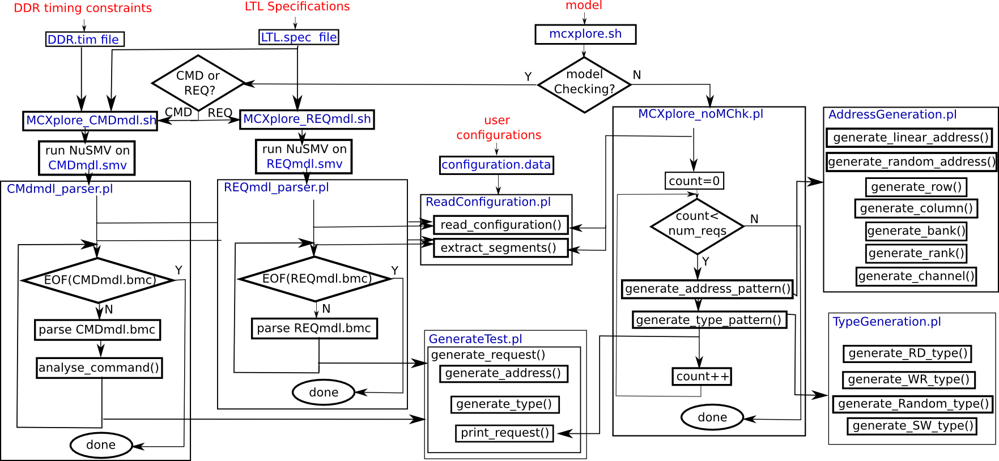

Introduction:
==============
MCXplore is an automation tool that generates tests to validate the memory system and evaluate its performance. The novel observation behind MCXplore is the following. Regardless of various policies proposed
for the memory system, the test pattern is still the same. This test pattern consists of a sequence of memory requests. Each request has three major components: the address, the transaction type (whether read or
write), and the transaction size (the number of bytes to transfer). Based on this observation, instead of building a validation framework per memory policy, MCXplore relies in the input test pattern to validate
any memory policy. MCXplore has two modes of operation: non model checking mode and model-checking mode.

Usage:
========
./ mcxplore [[-m model] [-o output_file] [-t DRAM_timing_file] [-s LTL_specs_file] |[-h]]

-m, --model		specify which model to use: \"CMDmdl\" for Model Checking Command model, \"REqmdl\" for Model Checking request model, or \"noMChk\" for the no model checking usage. noMChk is the default"

-o, --out		specify the output file name of the generated test. results/[model]/Test.trc is the default"

-t, --DDrTiming		specify the input timing file with DDR constraints. DDrTimings/DDR3_1600.tim is the default"

-s, --Spec  		specify the input LTL specification file that models the test plan. CMDmdl.spec is the default"

-h, --help		prints out this usage message"

Flow diagram:
=============

For detailed documentation:
=============================
Docs/Manual.pdf

